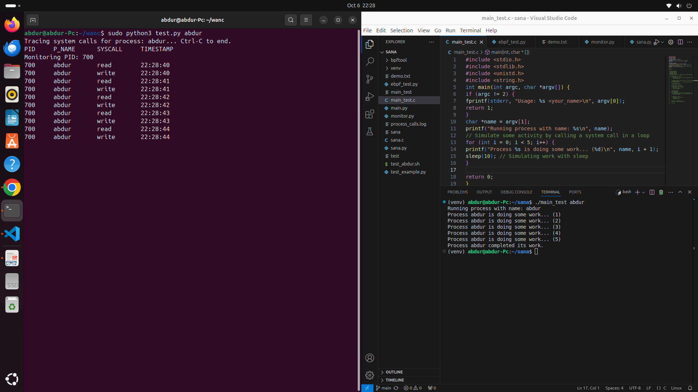
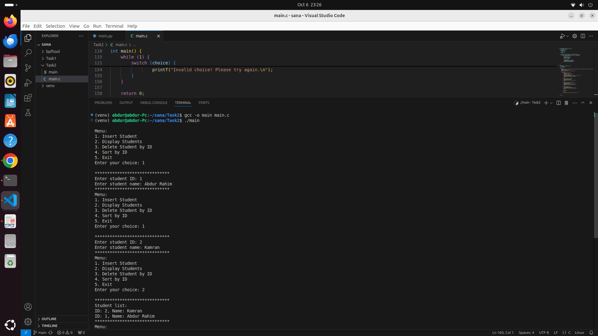

# Wanclouds assessment tasks

In this repository there are two tasks, that were given after the interview. 

## Table of Contents
- [Task 1: eBPF Program to Monitor and Log a Specific Process](#task-1-ebpf-program-to-monitor-and-log-a-specific-process)
- [Task 2: Doubly Linked List Implementation](#task-2-doubly-linked-list-implementation)
- [Installation and Usage](#installation-and-usage)
- [Further Improvements](#further-improvements)
- [My Findings](#my-findings)

---

## Task 1: eBPF Program to Monitor and Log a Specific Process

### Introduction
eBPF (Extended Berkeley Packet Filter) is a powerful feature in the Linux kernel that allows for the execution of sandboxed programs in response to various events. Its use cases include performance monitoring, network traffic filtering, and security enhancements. eBPF is advantageous due to its efficiency, flexibility, and ability to run without modifying kernel code.

### Implementation
Before diving into the implementation, ensure you have a suitable environment set up:

1. **Environment Setup**: 
   - It is highly recommended to create a virtual environment for this project. To create virtual enviroment, use the following commands:
     Here are the essential commands to set up and use a virtual environment in Linux:

 *Install `virtualenv` (if not already installed):*
   ```bash
   sudo apt install python3-venv
   ```

 *Create a virtual environment:*
   Navigate to your project folder and run:
   ```bash
   python3 -m venv <env_name>
   ```
   Replace `<env_name>` with the name you want for your environment.

  *Activate the virtual environment:*
   ```bash
   source <env_name>/bin/activate
   ```
   After activation, your shell will show the virtual environment name in the prompt.

 Now simply Install the required packages.


2. **Install BCC**:
   - Use the following commands to install BCC for eBPF implementation:
     ```bash
     sudo apt-get install bpftrace
     sudo apt-get install bcc-tools
     ```

### Challenges
During the implementation, I faced several challenges, which I solve by research and development.

- **Situation**: This was a completely new approach for me, diving into eBPF programming.
  
- **Task**: I had to set up the environment correctly and write an eBPF program to log system calls for a specific process.

- **Action**: 
  - I conducted extensive research and development, checking documentation, reading relevant blogs, and solving code problems from GitHub issues. 
  - Key resources included:
    - Official BCC documentation
    - GitHub issues and community forums

- **Result**: I successfully implemented eBPF through BCC. Below is a screenshot of the output:

# Task 1 output

   
   

### Further Improvements
By explicitly monitoring system calls, the program can log specific requests made by the process. This feature could enhance security by tracking potentially malicious activities if implemented correctly.

### My Findings
This task was a great learning experience. Despite the challenges, I became comfortable with Linux systems and gained valuable insights into eBPF programming.

---

## Task 2: Doubly Linked List Implementation

### Introduction
A Linked List is a linear data structure consisting of a sequence of elements, each pointing to the next. A Doubly Linked List is a type of Linked List where each node contains pointers to both the next and previous nodes, allowing for bidirectional traversal.

### Implementation
This implementation is done in C and supports insertion, deletion, sorting, and traversal of the list.

### Problems
Upon implementing the Doubly Linked List, I encountered several syntax issues due to a lack of recent practice with C programming.

### Approach
To overcome these issues, I utilized various resources:
- **GeeksforGeeks**
- **ChatGPT** for resolving specific syntax-related problems

### Result
I successfully implemented the Doubly Linked List, allowing for various operations. Below is a screenshot of the output:


# Task 2 output

  

---

## Further Improvements
- **Task 1**: Integrate more system calls and improve logging mechanisms.
- **Task 2**: Add search functionality and enhance error handling.

---

## My Findings
Both tasks provided valuable insights into system programming and data structures. I gained hands-on experience with eBPF and improved my C programming skills, which will significantly contribute to my professional development.

---

## Installation and Usage of repository

1. Clone the repository:
   ```bash
   git clone https://github.com/rahimnadan/wanclouds-assesment-tasks.git
   cd wanclouds-assessment-tasks
   ```

2. For Task 1, first run the eBPF program using:
   ```bash
   sudo python3 main.py <your name>
   ```
   Now run the program that accept your name as argument, which you want to monitor through eBPF
   ```bash
   python3 main.py <your name>
   ```
3. For Task 2, compile and run the C program:
   ```bash
   gcc -o main main.c
   ./main
   ```

---

